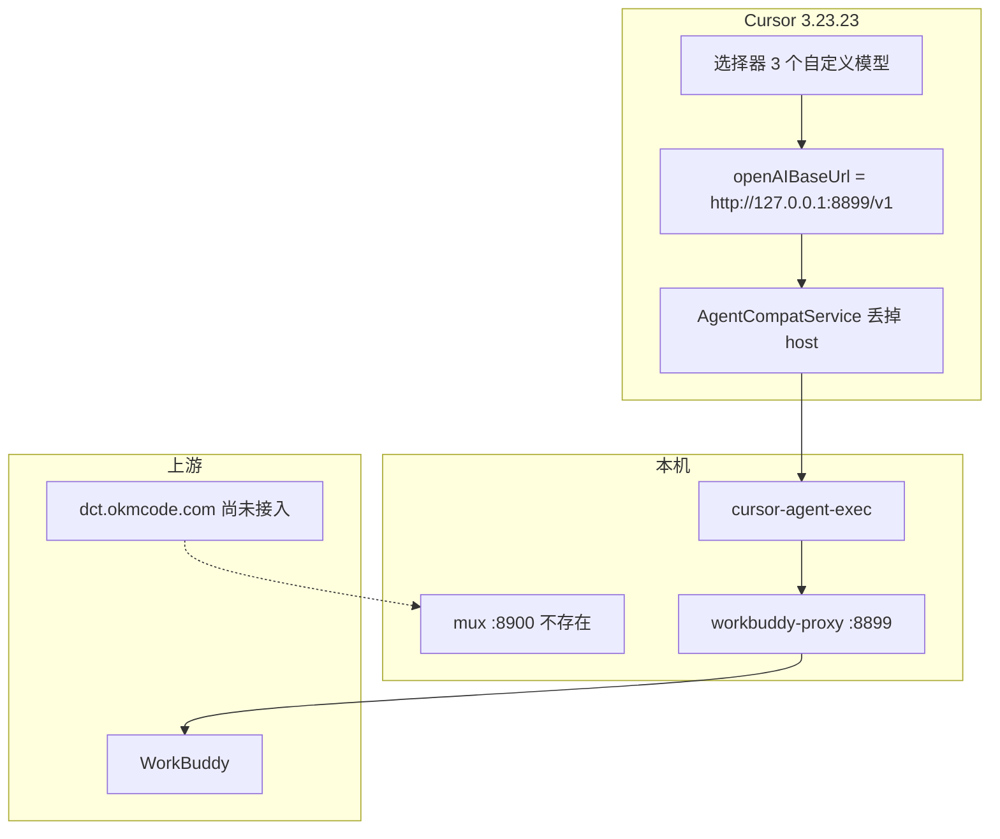
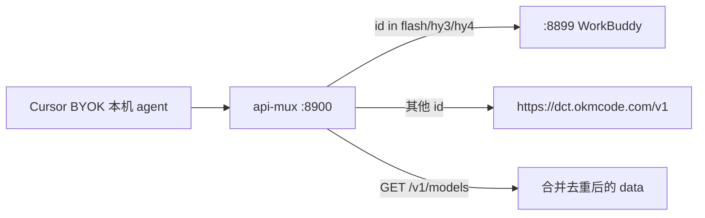

# Cursor 3.23.23 自定义 API 技术文档

> 分析日期：2026-10-06  
> 修订：同日，按现网能跑通的本机 BYOK 路径重写（废止隧道方案）  
> 目标版本：Cursor `3.23.23`（VS Code `1.128.0`）  
> 文档性质：机制说明 + 现状核验 + 已落地补丁  
> flavor：`null`（通用技术文档，叠加 Evidence → Finding → Path）  
> 敏感信息：真实 token / 完整密钥一律用占位符

---

## 0. 先确认我理解的意思

当前目标不是「再配一个 OpenAI Key 覆盖现在的」，也不是「把 WorkBuddy 卸掉换成 dct」，更不是再用 cloudflared 给 Cursor 开公网入口。

**已经落地、且你确认可以聊的是这一条：**

1. Cursor 只挂 **一个** 自定义 API：`http://127.0.0.1:8899/v1`。
2. 选择器只露出 WorkBuddy 三个模型：`deepseek-v4.1-flash` / `hy3` / `hy4-preview-f`。
3. Composer 走本机 `agent-exec`，直打 8899，不经过 Cursor 云端代发。
4. 系统重启、Cursor 重启、WorkBuddy 会话关掉，8899 仍由开机守护拉着，会话能继续。

**还没做、除非你再点头才做的：**

- 双 API 合流（dct `https://dct.okmcode.com/v1` + mux `:8900`）。Cursor 原生只有一个 `openAIBaseUrl`，要两边同时存在必须另加 mux。本文附录保留计划，不当成当前运行时。

旧版说明书把 `openAIBaseUrl` 写成 trycloudflare、把推理写成云端代发。那是绕 SSRF 的过渡方案，quick tunnel 随进程死会 1033。你已明确不用 cloudflared。以本文为准。

---

## 1. 执行摘要

Cursor 3.23.23 的「OpenAI API Key / Override OpenAI Base URL」不在 `settings.json`。它落在 `%APPDATA%\Cursor\User\globalStorage\state.vscdb` 的 reactive storage 键 `persistentStorage.applicationUser`。

Composer **默认**走 `AgentHostService`（`runtime=connect` / `managed-local-unavailable`），把 key + baseUrl 交给 Cursor 云端代发。云端 SSRF 禁止 `127.0.0.1`，于是出现 `Access to private networks is forbidden`。只改 `AgentClientService.run` 不够——那条路根本没人走。

正确分发：`useOpenAIKey=true` 时丢掉注入的 host 策略，回退 `Tnh` / `r$m` → `agentClientService.run` → `runLocalAgentInExtensionHost`。本机 `cursor-agent-exec` 再打 OpenAI 兼容 `/v1/chat/completions`。agent-host 激活 exec 时必须 `registerAgentExecProvider:!0`，否则 handler 永不挂上，约 70 秒 `ERROR_EXTENSION_HOST_TIMEOUT`。

当前已落地、刚才重新核过：

| 项 | 现状 |
|---|---|
| BYOK 开关 | `useOpenAIKey = true` |
| Base URL | `http://127.0.0.1:8899/v1`（**不是** trycloudflare） |
| 本机代理 | `127.0.0.1:8899` LISTENING；`/health` 200；`/v1/models` 200，3 个模型 |
| 隧道 | **不再用于 Cursor BYOK**。named tunnel `codeg.redromance.pro → 3086` 未改 |
| 选择器可见 | 只强制打开 3 个自定义模型；10 个官方名在 disabled 里 |
| 默认模型 | 各场景 `modelConfig` 都是 `deepseek-v4.1-flash` |
| 用量横幅 | Glass `mWv()` 已短路返回 `null`；desktop `x6e` / glass `O0e` 恒 `false` |
| 分发补丁 | `AgentCompatService` BYOK 时丢掉 host 策略 |
| provider 注册 | `cursor-agent-host` `registerAgentExecProvider:!0` |
| 回环放行 | `cursor-agent-exec` / `cursor-local-agent-runtime` 放行 `127.0.0.1` / `::1` / `localhost` |
| 8899 守护 | 开机项 `WorkBuddy-Proxy.bat` → `launcher.py watch --port 8899` |
| 合流 | **未做**。`127.0.0.1:8900` 无监听 |

用户侧已确认新会话可以回复。Cursor 更新会覆盖全部 JS 补丁。

---

## 2. 范围与授权

- **授权**：本机 Cursor 安装目录与本机用户配置，由你明确要求配置自定义 API，并在确认「可以了」后要求更新本文。
- **in_scope**：Cursor 3.23.23 客户端 BYOK / 模型选择器 / 用量横幅 / Composer 本机分发补丁；本机 WorkBuddy 代理 `8899` 与开机守护。
- **out_scope**：不改 `workbuddy-proxy.py`；不动 named tunnel `codeg.redromance.pro → 127.0.0.1:3086`；不再给 Cursor BYOK 起 cloudflared；本文不实施 mux。
- **network_profile**：仅本机回环 `127.0.0.1:8899`。dct 公网 HTTPS 只出现在未实施附录。
- **case 目录**：本次是配置/逆向说明，不另开渗透 case。

---

## 3. 证据链

### 3.1 Evidence

#### E-001
- title: BYOK 不在 settings.json，而在 vscdb reactive storage
- observed_at: 2026-10-06
- source_type: file
- source_ref: `%APPDATA%\Cursor\User\settings.json`；`state.vscdb` 键 `src.vs.platform.reactivestorage.browser.reactiveStorageServiceImpl.persistentStorage.applicationUser`
- content_hash: n/a
- artifact_path: n/a
- severity: info
- status: validated
- repro_command: |
    python 只读打开 `state.vscdb`，取上述键 JSON；对照 `settings.json`
- raw_excerpt: |
    settings.json 仅 `window.autoDetectColorScheme`。
    applicationUser.useOpenAIKey = true
    applicationUser.openAIBaseUrl = http://127.0.0.1:8899/v1
    钥匙键 = secret://cursorAuth/openAIKey（Node Buffer JSON；明文 fallback cursorAuth/openAIKey 可缺席）
- linked_workitem: n/a
- supersedes: none

#### E-002
- title: 3.23.23 的 getModels() 是空实现
- observed_at: 2026-10-06
- source_type: file
- source_ref: `resources/app/out/vs/workbench/workbench.desktop.main.js`
- content_hash: sha256 `c251c978ddc1db36aaa9aab80bea3fd5eaf8a917eed2e08919522fe8c9e7b9e8`（含分发补丁后的当前文件）
- artifact_path: n/a
- severity: medium
- status: validated
- repro_command: |
    在 `workbench.desktop.main.js` 搜索 `async getModels`
- raw_excerpt: |
    async getModels(e){return{models:[]}}
- linked_workitem: n/a
- supersedes: none

#### E-003
- title: 选择器过滤公式与当前覆盖列表
- observed_at: 2026-10-06
- source_type: file
- source_ref: `applicationUser.aiSettings.modelOverrideEnabled` / `modelOverrideDisabled` / `availableDefaultModels2`
- content_hash: n/a
- artifact_path: n/a
- severity: info
- status: validated
- repro_command: |
    只读解析 applicationUser JSON
- raw_excerpt: |
    enabled = ["deepseek-v4.1-flash","hy3","hy4-preview-f"]
    disabled = ["default","grok-4.7","grok-4.6","composer-2.5","grok-4.5","kimi-k3","kimi-k2.7-code","glm-5.2","glm-5p3","glm-5p3-flash"]
    catalog 13 项 = 10 个官方 + 3 个自定义（官方刷新会写回来）
    各场景 modelConfig = deepseek-v4.1-flash
    cursor.modelCatalogOwnKey.gateEnabled = false
    当前选中 = deepseek-v4.1-flash
- linked_workitem: n/a
- supersedes: none

#### E-004
- title: 本机 8899 /health 与 /v1/models 均 200，返回 3 个模型
- observed_at: 2026-10-06（文档修订时复核）
- source_type: network
- source_ref: `http://127.0.0.1:8899/health`；`http://127.0.0.1:8899/v1/models`
- content_hash: n/a
- artifact_path: n/a
- severity: info
- status: validated
- repro_command: |
    GET /health
    GET /v1/models ，Authorization: Bearer sk-wb-<REDACTED>，必须带 Host: 127.0.0.1:8899
- raw_excerpt: |
    health 200
    models 200 ids = deepseek-v4.1-flash, hy3, hy4-preview-f
    127.0.0.1:8899 LISTENING
    8900 无监听
- linked_workitem: n/a
- supersedes: 旧 E-004（含隧道 /v1/models）

#### E-005
- title: dct.okmcode.com /v1/models 返回 144 个 id（合流未实施）
- observed_at: 2026-10-06
- source_type: network
- source_ref: `https://dct.okmcode.com/v1/models`
- content_hash: n/a
- artifact_path: n/a
- severity: info
- status: validated
- repro_command: |
    GET https://dct.okmcode.com/v1/models ，Authorization: Bearer sk-<REDACTED>
- raw_excerpt: |
    STATUS 200 N=144
    含 composer-2.5 / grok-4.5 / grok-4.6 / grok-4.7 以及大量 grok/、x-ai/、xai/ 前缀别名
    不含 deepseek-v4.1-flash / hy3 / hy4-preview-f
- linked_workitem: n/a
- supersedes: none

#### E-006
- title: WorkBuddy 代理只认回环 Host；8899 由开机守护拉起
- observed_at: 2026-10-06
- source_type: file
- source_ref: `E:\Exploitation\VS_Tools\Ds_Tools\workbuddy-fix\workbuddy-proxy.py` `_host_ok`；`%APPDATA%\Microsoft\Windows\Start Menu\Programs\Startup\WorkBuddy-Proxy.bat`
- content_hash: n/a
- artifact_path: n/a
- severity: medium
- status: validated
- repro_command: |
    阅读 `_host_ok`；阅读开机 bat
- raw_excerpt: |
    Host 名必须是 127.0.0.1 / localhost / ::1，或 --public-host 白名单
    WorkBuddy-Proxy.bat → pythonw launcher.py watch --port 8899
    与 Cursor / WorkBuddy 会话无关；代理挂了守护会拉回
    未改 workbuddy-proxy.py
- linked_workitem: n/a
- supersedes: 旧 E-006（隧道必须改写 Host）

#### E-007
- title: 用量横幅真正渲染点是 Glass mWv()，实验开关 false 会掉进 legacy
- observed_at: 2026-10-06
- source_type: file
- source_ref: `workbench.glass.main.js` `mWv`；`workbench.desktop.main.js` `x6e`
- content_hash: glass sha256 `cfd78705242c354db53cde50f18a26328af46e286d93525dce83ce8eed82c4de`（含分发补丁后的当前文件）
- artifact_path: n/a
- severity: low
- status: validated
- repro_command: |
    搜索 `function mWv(t){return null;` / `function x6e({group:e,killSwitch:t,isEnterprise:n}){return!1}` / `function O0e(...){return!1}`
- raw_excerpt: |
    三处补丁均仍在当前 JS 里。Cursor 更新会覆盖。
- linked_workitem: n/a
- supersedes: none

#### E-008
- title: Composer 默认走 AgentHost 云端，BYOK 必须丢掉 host 策略
- observed_at: 2026-10-06
- source_type: file
- source_ref: `workbench.desktop.main.js` / `workbench.glass.main.js` `AgentCompatService` 构造；日志 `Cursor Agent Host.log`
- content_hash: desktop sha256 `c251c978ddc1db36aaa9aab80bea3fd5eaf8a917eed2e08919522fe8c9e7b9e8`
- artifact_path: `.wb_backup\workbench.*.js.bak_20261006_065255_pre_host_bypass`
- severity: high
- status: validated
- repro_command: |
    搜索 `this._executionStrategy=(this.reactiveStorageService.applicationUserPersistentStorage.useOpenAIKey===!0?void 0:`
- raw_excerpt: |
    未补丁日志：runtime=connect / managed-local-unavailable → 云端 SSRF
    只改 AgentClientService.run 时，日志没有 Running agent turn through local agent-exec runtime
    补丁后：useOpenAIKey===!0 丢掉 e?.executionStrategy，回退 new Tnh / new r$m
    Glass 标识符是 r$m 不是 Tnh；不要写成 r\$m
- linked_workitem: n/a
- supersedes: none

#### E-009
- title: agent-host 默认 registerAgentExecProvider:!1，BYOK 必须改成 !0
- observed_at: 2026-10-06
- source_type: file
- source_ref: `resources/app/extensions/cursor-agent-host/dist/main.js`
- content_hash: sha256 `b31792d633893e80ac83fa01f71474447d228b65da5359849bdba7cbb95e3d86`
- artifact_path: `.wb_backup\cursor-agent-host.main.js.bak_20261006_122353`
- severity: high
- status: validated
- repro_command: |
    搜索 `registerAgentExecProvider:!0`
- raw_excerpt: |
    原：activateExec 硬传 registerAgentExecProvider:!1（move_exec OFF 防双注册）
    现象：分发已命中本机 8899，但 waitForProviderRegistration 尝试 1=30s + 2–8=5s ≈ 70s 后 ERROR_EXTENSION_HOST_TIMEOUT
    改：activateExec:r=>t.activate(e,{registerAgentExecProvider:!0,runtimeExtensionPath:t.extensionPath,...r})
- linked_workitem: n/a
- supersedes: none

#### E-010
- title: agent-exec / local-agent-runtime 默认禁止 localhost fetch，已放行回环
- observed_at: 2026-10-06
- source_type: file
- source_ref: `cursor-agent-exec/dist/main.js`；`cursor-local-agent-runtime/dist/main.js`
- content_hash: exec `e5746e72d69fd92afa0f159d7ec9d463d211fc877a2b4231d36f3c98022078f8`；runtime `6d7d831f0a93f7a9d248b4cf447235dfce5dbeec070e0b0c9d3b6b47b3c5a1ed`
- artifact_path: `.wb_backup\cursor-agent-exec.main.js.bak`；`.wb_backup\cursor-local-agent-runtime.main.js.bak`
- severity: high
- status: validated
- repro_command: |
    搜索 `127.0.0.1` / `localhost` / `::1` 放行分支
- raw_excerpt: |
    本机 agent-exec 默认禁止 localhost/私网 fetch。
    已放行 127.0.0.1 / ::1 / localhost，其它私网仍拦。
- linked_workitem: n/a
- supersedes: none

### 3.2 Findings

#### F-001
- title: Cursor 原生只能挂一个自定义 OpenAI 兼容入口
- severity: medium
- category: design
- status: validated
- evidence_ids: [E-001, E-002]
- location: `applicationUser.useOpenAIKey` + `openAIBaseUrl`；`async getModels(e){return{models:[]}}`
- impact: 直接把 dct 写进 `openAIBaseUrl` 会踢掉 WorkBuddy。客户端也不会自动拉 `/v1/models` 填选择器。
- confidence: high
- repro_steps:
  1. 读 applicationUser，确认只有一个 `openAIBaseUrl`。
  2. 读 `getModels` 空实现。
- remediation: 要双 API 同时存在，只能在 Cursor 前面做 mux。当前不做。

#### F-002
- title: 私网报错的根因是 Composer 走云端代发，不是 hosts，也不是 8899 挂了
- severity: high
- category: design
- status: validated
- evidence_ids: [E-004, E-008, E-010]
- location: `AgentCompatService._executionStrategy` 被注入成 `AgentHostService`
- impact: `http://127.0.0.1:8899/v1` 配得上，聊天仍会 `Access to private networks is forbidden`。quick tunnel 能绕 SSRF，但进程一死就 1033，已废弃。
- confidence: high
- repro_steps:
  1. 不改 host 策略，只改 `AgentClientService.run` → 日志仍是 `runtime=connect`。
  2. BYOK 时丢掉 host 策略 → 日志出现 `Running agent turn through local agent-exec runtime`。
- remediation: 本机分发 + 回环放行。不要再用 cloudflared 给 Cursor BYOK。

#### F-003
- title: 官方目录刷新会把官方模型写回 catalog，必须靠 disabled 挡住
- severity: medium
- category: misconfig
- status: validated
- evidence_ids: [E-003]
- location: `availableDefaultModels2` ∩ `aiSettings.modelOverrideDisabled`
- impact: 只改 catalog、不写 disabled，重启/刷新后官方模型会重新出现在选择器。disabled 名单会被裁成「仍在新目录里的名字」，所以官方名必须继续留在 disabled。
- confidence: high
- repro_steps:
  1. 当前 catalog 已是 10 官方 + 3 自定义。
  2. 选择器仍只靠 enabled − disabled 露出 3 个自定义。
- remediation: 自定义进 enabled；官方名继续进 disabled。合流若做，撞名的 dct id 要从 disabled 移除。

#### F-004
- title: dct 与官方目录撞名，和 WorkBuddy 不撞名（仅对未实施合流有意义）
- severity: medium
- category: other
- status: validated
- evidence_ids: [E-003, E-005]
- location: dct 模型 id ∩ disabled 官方名
- impact: 若继续 disable `composer-2.5`/`grok-4.5`/`grok-4.6`/`grok-4.7`，dct 同名模型进不了选择器。
- confidence: high
- repro_steps:
  1. 对比 dct 144 id 与 disabled 列表。
  2. 对比 WorkBuddy 3 id，无交集。
- remediation: 合流未实施。实施时 mux 路由以 model id 为准；撞名 id 明确划给 dct。

#### F-005
- title: 用量横幅要补渲染函数，只关实验开关不够
- severity: low
- category: bypass
- status: validated
- evidence_ids: [E-007]
- location: `workbench.glass.main.js` `mWv()`
- impact: 只把 `x6e`/`O0e` 改 false，会掉进 Glass legacy 托盘，「Usage limit reached」还在。
- confidence: high
- repro_steps:
  1. 只改实验函数 → 横幅仍在（已踩过）。
  2. `mWv` 开头 `return null` → 卡片不画。
- remediation: 更新 Cursor 后要重打三处补丁。

#### F-006
- title: 本机分发命中后仍会 70 秒超时，除非 agent-host 注册 exec provider
- severity: high
- category: misconfig
- status: validated
- evidence_ids: [E-009]
- location: `cursor-agent-host/dist/main.js` `activateExec`
- impact: 日志已有 `Running agent turn through local agent-exec runtime` 和 `baseUrl=http://127.0.0.1:8899/v1`，会话仍 `Agent Execution Timed Out`。
- confidence: high
- repro_steps:
  1. 只打 host 策略旁路 → 12:17 日志命中本机，随后 `ERROR_EXTENSION_HOST_TIMEOUT`。
  2. `registerAgentExecProvider:!0` 后用户确认可以聊。
- remediation: BYOK 必须把该标志改成 `!0`。不要在 agent-host 里硬改 `agent_host_local_loop`。

### 3.3 Path

#### P-001 当前已落地的调用链
- title: 单 API（WorkBuddy）从选择器到上游
- path_type: callflow
- start: Cursor 模型选择器
- goal: WorkBuddy 上游 chat
- steps:
  1. action: 选择器按 (catalog.defaultOn ∪ enabled) − disabled 露出 3 个自定义模型 — evidence: E-003 — finding: F-003
  2. action: `useOpenAIKey===!0`，`AgentCompatService` 丢掉注入的 `AgentHostService`，回退 `Tnh`/`r$m` — evidence: E-008 — finding: F-002
  3. action: `Tnh.executeTurn` → `AgentClientService.run` → `runLocalAgentInExtensionHost` — evidence: E-008 — finding: F-002
  4. action: agent-host 以 `registerAgentExecProvider:!0` 激活 exec，handler 挂上 — evidence: E-009 — finding: F-006
  5. action: `cursor-agent-exec` 放行回环，POST `http://127.0.0.1:8899/v1/chat/completions` — evidence: E-010, E-004 — finding: F-002
  6. action: workbuddy-proxy 自己实现 `/v1/models`，chat 转上游；Host 必须是回环 — evidence: E-006 — finding: none
- residual_risks: Cursor 更新覆盖 JS 补丁；官方目录刷新依赖 disabled；8899 守护挂了则两边一起挂。

#### P-002 拟议双 API 合流（未实施）
- title: Cursor 单槽位 + 本机 mux 分流
- path_type: callflow
- start: Cursor 仍只配一个 baseUrl
- goal: 按 model id 打到 8899 或 dct
- steps:
  1. action: 新建 `127.0.0.1:8900` mux，合并 `/v1/models` — evidence: E-004, E-005 — finding: F-001
  2. action: 把 `openAIBaseUrl` 改成 `http://127.0.0.1:8900/v1`（仍走本机 agent，不走隧道） — evidence: E-008 — finding: F-002
  3. action: flash/hy3/hy4 → 8899（带 WorkBuddy key）；其余 → dct（带 dct key） — evidence: E-005 — finding: F-004
  4. action: 选择器 enabled = WorkBuddy 3 个 + dct 列表；disabled 保留官方名，但移出与 dct 撞名的四个 — evidence: E-003 — finding: F-003, F-004
- residual_risks: 选择器会变得很长（3+144）；撞名模型看起来像官方，实际走 dct；mux 挂了则两边一起挂。
- 状态: **未实施。你再次确认前不动。**

### 3.4 Timeline 摘要

| 时间 | 事件 |
|---|---|
| 此前 | hosts 劫持排查：当前 `hosts` 无 cursor 劫持；残留后缀文件系统不认 |
| 此前 | 把 BYOK 指到 `http://127.0.0.1:8899/v1`，选择器只留 3 个自定义模型 |
| 此前 | 云端报私网禁止；上 quick tunnel + Host 改写（过渡） |
| 此前 | 用量横幅：先改 `x6e`/`O0e` 不够，再短路 `mWv()` |
| 此前 | 提出双 API，确认必须 mux；只写计划 |
| 2026-10-06 | quick tunnel 随会话死 → Cloudflare 1033 |
| 同日 | 猫总令：不用 cloudflared，回到单纯自定义 API |
| 同日 | `openAIBaseUrl` 改回本机；打 `AgentClientService.run` 仍不够 |
| 同日 | 根因：Composer 走 `AgentHostService`；补 `AgentCompatService` 旁路 |
| 同日 12:17 | 本机分发命中 8899，70 秒 `ERROR_EXTENSION_HOST_TIMEOUT` |
| 同日 | `registerAgentExecProvider:!0`；用户确认「不错，可以了」 |
| 同日 | 本文按本机路径重写，废止隧道方案 |

---

## 4. Cursor 自定义 API 怎么工作

### 4.1 先看这一层


有四个容易想错的点：

1. **配置不在 `settings.json`。** 那个文件现在只有主题自动切换。
2. **选择器不读你的 `/v1/models`。** `getModels()` 直接 `return {models:[]}`。
3. **Composer 默认不走本机直连。** 未打旁路时，云端拿到 key 和 baseUrl 再向外发，私网地址直接拒绝。
4. **只改 `AgentClientService.run` 不够。** 真正入口是 `AgentCompatService._executionStrategy`。默认被注入成 `AgentHostService`。

废弃路径（不要再用）：

```text
选择器 → 云端 BYOK 代发 → cloudflared quick tunnel → 8899
```

### 4.2 存储位置

| 层级 | 路径 / 键 | 作用 |
|---|---|---|
| 不要看这个 | `%APPDATA%\Cursor\User\settings.json` | 与 BYOK 无关 |
| 也不要看这个 | ItemTable 顶层 `applicationUser` | 本机这份库里根本没有这个键 |
| 真正的配置 | ItemTable `src.vs.platform.reactivestorage.browser.reactiveStorageServiceImpl.persistentStorage.applicationUser` | JSON：`useOpenAIKey`、`openAIBaseUrl`、catalog、`aiSettings.*` |
| key | `secret://cursorAuth/openAIKey` | 运行时解密的 Node Buffer JSON；明文 fallback 键 `cursorAuth/openAIKey` 当前不存在 |
| 选择器记忆 | `cursor/applicationOpenModelAppliedConfig` | 当前选中 `deepseek-v4.1-flash` |
| 目录门闩 | `cursor.modelCatalogOwnKey.gateEnabled` | 当前为 `false`；自定义模型仍靠 catalog + override 活着 |
| 备份 | `D:\Program Files\cursor\.wb_backup\` | vscdb / workbench / agent-host / agent-exec / runtime 均有 bak |

关键字段（现网）：

```text
useOpenAIKey        = true
openAIBaseUrl       = http://127.0.0.1:8899/v1
aiSettings.userAddedModels        = 三个 WorkBuddy id
aiSettings.modelOverrideEnabled   = 同上
aiSettings.modelOverrideDisabled  = 十个官方 id（含 Auto/default）
aiSettings.modelConfig.*          = 全场景 deepseek-v4.1-flash
availableDefaultModels2           = 官方刷新后的 10 + 自定义 3
availableAPIKeyModels             = []
```

### 4.3 选择器公式

可见模型：

```text
visible = (catalog 里 defaultOn=true 的名字  ∪  modelOverrideEnabled)
          − modelOverrideDisabled
```

所以：

- 自定义模型必须写进 **catalog**（否则连 override 都没对象）以及 **enabled**（因为它们 `defaultOn=false`）。
- 官方模型刷新回来以后，只要名字还在 catalog，就必须继续写在 **disabled**。
- 官方刷新会把 disabled **裁成「新目录里还存在的名字」**。目录里没了的官方旧名会被丢掉，这是预期；新官方名如果没进 disabled，会漏出来。

3.23.23 **不会**在保存 key 时去打 `/v1/models` 自动灌目录。`getModels` 是空的。模型列表是我们写进 vscdb 的。

### 4.4 为什么曾经必须公网 HTTPS，现在不必

未打分发补丁时，客户端把 BYOK 详情交给云端。云端拒绝：

- `127.0.0.1` / `localhost`
- RFC1918 私网
- 典型链路本地址

报错原文：`Access to private networks is forbidden`。

当时用 quick tunnel 把 8899 变成公网 HTTPS，并且必须 `--http-host-header 127.0.0.1:8899`（代理 `_host_ok()` 只认回环 Host）。quick tunnel 主机名随进程变；关掉 WorkBuddy 会话后出现 Cloudflare 1033。

**现网不再走这条路。** BYOK 时丢掉 `AgentHostService`，本机 `agent-exec` 直打 `http://127.0.0.1:8899/v1`。cloudflared 不参与 Cursor BYOK。

禁止改 `C:\Users\26525\.cloudflared\config.yml` 里那条 `codeg.redromance.pro → 3086`。那是别的服务。

### 4.5 本机分发补丁（最小集合）

必须五处一起在，缺一不可：

| 补丁 | 文件 | 作用 |
|---|---|---|
| `AgentCompatService` 构造 | `workbench.desktop.main.js` / `workbench.glass.main.js` | `useOpenAIKey===!0` 时丢掉注入的 host 策略，回退 `Tnh` / `r$m` |
| `AgentClientService.run` | 同上两份 JS | `useOpenAIKey===!0` 时走 `runLocalAgentInExtensionHost` |
| `registerAgentExecProvider:!0` | `extensions/cursor-agent-host/dist/main.js` | 否则 `waitForProviderRegistration` 70 秒超时 |
| 回环放行 | `cursor-agent-exec/dist/main.js`、`cursor-local-agent-runtime/dist/main.js` | 否则本机 fetch 仍拦 localhost |
| 用量横幅 | desktop `x6e`、glass `O0e`、glass `mWv` | `mWv` 才是真正不画卡片 |

desktop 构造现场：

```js
this._executionStrategy=(this.reactiveStorageService.applicationUserPersistentStorage.useOpenAIKey===!0?void 0:e?.executionStrategy)??new Tnh(this.agentClientService)
```

glass 标识符是 `r$m`，不是 `Tnh`。`$` 不要写成 `\$`。

agent-host 激活现场：

```js
activateExec:r=>t.activate(e,{registerAgentExecProvider:!0,runtimeExtensionPath:t.extensionPath,...r})
```

不要做：

- 不要把 `yc.localMode` 全局打开
- 不要在 agent-host 里硬改 `agent_host_local_loop`（那是另一条私有推理环）
- 不要再用 cloudflared 给 Cursor BYOK

补丁在进程启动时加载。改完必须 **彻底退出 Cursor 再开**。从本会话拉 GUI 前要清掉 `ELECTRON_RUN_AS_NODE`，否则 `Cursor.exe` 当 Node 起、窗口起不来。用户自己点快捷方式不受影响。Git Bash 还会把 `--remote-debugging-port` 当成 Cursor 自身选项（`bad option`）。

### 4.6 用量横幅

| 补丁 | 文件 | 现状 | 作用 |
|---|---|---|---|
| `x6e` 恒 `return!1` | `workbench.desktop.main.js` | 仍在 | 关掉 desktop 实验横幅 |
| `O0e` 恒 `return!1` | `workbench.glass.main.js` | 仍在 | 关掉 glass 实验横幅 |
| `mWv` 开头 `return null` | `workbench.glass.main.js` | 仍在 | **真正不画卡片**。只改上面两个会掉进 legacy「Usage limit reached / Set new limit」 |

这三处都会被 Cursor 更新覆盖。

### 4.7 8899 生命周期

WorkBuddy 代理听 `127.0.0.1:8899`。`/v1/models` 由代理自己实现（`FREE_MODELS` 三个 id）。无 `/v1/responses`。

开机项：

```text
%APPDATA%\Microsoft\Windows\Start Menu\Programs\Startup\WorkBuddy-Proxy.bat
  → pythonw launcher.py watch --port 8899
  → pythonw launcher.py open-admin --port 8899
```

工作目录：`E:\Exploitation\VS_Tools\Ds_Tools\workbuddy-fix`

与 Cursor 进程、WorkBuddy 会话都无关。代理挂了，`watch` 会拉回。不要改 `workbuddy-proxy.py`。无效开机项 `CursorBYOKProxy.bat` 已删。

---

## 5. 当前运行时（2026-10-06 修订复核）



| 组件 | 状态 |
|---|---|
| BYOK | `useOpenAIKey=true`，baseUrl 本机 8899 |
| python 代理 | `127.0.0.1:8899 LISTENING`，health/models 200 |
| cloudflared（Cursor BYOK） | **不使用** |
| mux | **没有** |
| named tunnel | 仍是 `codeg.redromance.pro → 3086`，未改 |

WorkBuddy 三个模型（代理 `FREE_MODELS`，也是当前选择器）：

| id | 说明 |
|---|---|
| `deepseek-v4.1-flash` | 默认模型 |
| `hy3` | 混元 Hy3 |
| `hy4-preview-f` | 混元 Hy4 预览 |

凭证（文档占位，不写原文）：

| 用途 | 占位 |
|---|---|
| WorkBuddy / 当前 Cursor BYOK | `sk-wb-<REDACTED>` |
| dct（未接入） | `sk-<REDACTED>` |

---

## 6. 为什么第二条 API 不能「再填一格」

Cursor 3.23 的 OpenAI 兼容 BYOK 是单槽：

- 一个 `useOpenAIKey`
- 一个 `openAIBaseUrl`
- 一把 secretStorage 里的 key

没有「Provider 列表」。没有第二套 Base URL UI。`getModels` 还是空的，就算 dct 自己有 144 个模型，客户端也不会去拉。

因此「两个自定义 API 和两份模型列表同时存在」= **Cursor 仍然只看见 mux 这一个 OpenAI 兼容服务**。当前运行时没有 mux。

备选方案和为什么不用：

| 方案 | 结论 |
|---|---|
| 改 Cursor 源码支持多 baseUrl | 每次更新重做，过重 |
| 两个 Cursor 配置来回切 | 做不到「同时存在」 |
| 把 dct 模型假写进选择器但 baseUrl 仍是 8899 | 请求会打到 WorkBuddy，404/拒模 |
| 改 `workbuddy-proxy.py` 兼做合流 | 现有代理承担 ZCode / 账号池 / Host 校验，不该绑死 Cursor |
| 再用 cloudflared 给 mux 开公网 | 已证明会 1033；本机 agent 不需要公网 |

---

## 7. 合流方案（计划，未落地）

你再次确认前 **不写 mux、不改 8899、不改选择器、不改 named tunnel**。

### 7.1 形态

若实施，新建独立脚本（例如 `D:\Program Files\cursor\tools\api-mux.py`），监听 `127.0.0.1:8900`。标准库即可，不改 WorkBuddy 代理。



Cursor 侧永远只有：

```text
openAIBaseUrl = http://127.0.0.1:8900/v1
Authorization = 一把前置 key
```

**不要**再给 mux 套 cloudflared。本机 agent 已经能打回环。

### 7.2 mux 行为

| 端点 | 行为 |
|---|---|
| `GET /v1/models` | 并行拉 8899 与 dct；合并 `data`；同 id 保留先到（WorkBuddy 优先） |
| `POST /v1/chat/completions` | 读 JSON `model` 字段分流 |
| 其它 OpenAI 形态 | 同样按 `model` 分流；不认识的路径对当前目标上游原样转发 |
| 流式 | 透传 SSE，不缓冲整包 |
| 鉴权 | Cursor 仍带一把 key。mux 校验前置 key 后，**按上游替换 Authorization** |

分流表（此前实测，无 WorkBuddy∩dct 碰撞）：

```text
deepseek-v4.1-flash  →  http://127.0.0.1:8899
hy3                  →  http://127.0.0.1:8899
hy4-preview-f        →  http://127.0.0.1:8899
其它已知 id           →  https://dct.okmcode.com
未知 id               →  dct（默认），避免误伤 dct 新模型
```

8899 必须继续带 `Host: 127.0.0.1:8899`。mux 打本机代理时自己写这个头。

### 7.3 选择器怎么改

因为 `getModels()` 是空的，mux 合并目录 **不会**自动出现在 UI。还得写 vscdb：

1. 把 dct 的 id 追加进 catalog / `userAddedModels` / `modelOverrideEnabled`。
2. `modelOverrideDisabled` 继续覆盖官方目录名，但 **删除与 dct 撞名的** `composer-2.5` / `grok-4.5` / `grok-4.6` / `grok-4.7`。
3. 默认模型保持 `deepseek-v4.1-flash`。
4. `default`（Auto）继续 disable。Auto 走 Cursor 官方路由，不是 BYOK mux。

撞名的后果：选择器里的 `composer-2.5` / `grok-4.7` 看起来像官方，点下去会打到 dct。这是「两份列表同时存在」的必然结果，不是 bug。

### 7.4 你需要拍板的两点（合流若做）

1. **dct 模型进选择器的粒度**
   - A. 全量 144（含 `grok/` `x-ai/` `xai/` 别名，列表会很难翻）
   - B. 去前缀别名，只保留不带 `/` 的 id —— 倾向这个
2. **撞名模型**
   - 从 disabled 拿掉四个撞名，让它们作为 dct BYOK 模型出现
   - 或者继续藏起来，dct 同名等于废了

默认模型、WorkBuddy 三模型、8899 代理、named tunnel，这些合流时也不改。

---

## 8. 故障对照

| 现象 | 真正原因 | 不要做的事 |
|---|---|---|
| Provider Error / private networks | Composer 走 `AgentHostService` 云端 SSRF | 不要以为是 hosts 没清干净；不要急着重开 cloudflared |
| Cloudflare 1033 | quick tunnel 随进程死 | 不要把 named tunnel 改去救 Cursor BYOK |
| 代理 403 host not allowed | Host 不是回环 | 不要给 8899 加 `--public-host` 去迁就公网域名 |
| 保存了自定义 API 但选择器没新模型 | `getModels()` 空实现 | 不要等客户端自己刷新 `/v1/models` |
| 官方模型又出现 | catalog 刷新 + disabled 没覆盖新名 | 不要只改 catalog |
| Usage limit reached 还在 | 只关了实验开关，legacy `mWv` 仍在画 | 不要只搜 experiment flag |
| 配了两个 URL 只生效一个 | 单槽 BYOK | 不要在 vscdb 里找第二个 baseUrl 字段 |
| 已命中本机 8899 仍 70 秒超时 | `registerAgentExecProvider:!1` | 不要只盯 `AgentClientService.run` |
| 只改了 `AgentClientService.run` 仍走云端 | `_executionStrategy` 仍是 host | 必须改 `AgentCompatService` 构造 |
| 从本会话拉 Cursor 没窗口 | `ELECTRON_RUN_AS_NODE=1` | 从开始菜单/快捷方式开；清掉该环境变量 |
| Git Bash 报 `bad option` | bash 把 `--remote-debugging-port` 传给了 Cursor | 不要用 Git Bash 直接塞 Electron 调试参数 |
| Cursor 更新后私网/横幅回来 | JS 补丁被覆盖 | 按 §4.5 五处重打 |

---

## 9. 附录

### 9.1 关键路径

| 对象 | 路径 |
|---|---|
| Cursor 安装 | `D:\Program Files\cursor\` |
| 主 JS | `resources\app\out\vs\workbench\workbench.desktop.main.js` |
| Glass JS | `resources\app\out\vs\workbench\workbench.glass.main.js` |
| agent-host | `resources\app\extensions\cursor-agent-host\dist\main.js` |
| agent-exec | `resources\app\extensions\cursor-agent-exec\dist\main.js` |
| local-agent-runtime | `resources\app\extensions\cursor-local-agent-runtime\dist\main.js` |
| 用户库 | `%APPDATA%\Cursor\User\globalStorage\state.vscdb` |
| WorkBuddy 代理 | `E:\Exploitation\VS_Tools\Ds_Tools\workbuddy-fix\workbuddy-proxy.py` |
| 开机守护 | `%APPDATA%\Microsoft\Windows\Start Menu\Programs\Startup\WorkBuddy-Proxy.bat` |
| named tunnel（禁止改） | `%USERPROFILE%\.cloudflared\config.yml` |
| 备份 | `D:\Program Files\cursor\.wb_backup\` |

### 9.2 版本指纹（含补丁后的当前文件）

| 文件 | 值 |
|---|---|
| Cursor version | 3.23.23 |
| vscodeVersion | 1.128.0 |
| desktop.main.js sha256 | `c251c978ddc1db36aaa9aab80bea3fd5eaf8a917eed2e08919522fe8c9e7b9e8` |
| glass.main.js sha256 | `cfd78705242c354db53cde50f18a26328af46e286d93525dce83ce8eed82c4de` |
| cursor-agent-host/main.js | `b31792d633893e80ac83fa01f71474447d228b65da5359849bdba7cbb95e3d86` |
| cursor-agent-exec/main.js | `e5746e72d69fd92afa0f159d7ec9d463d211fc877a2b4231d36f3c98022078f8` |
| cursor-local-agent-runtime/main.js | `6d7d831f0a93f7a9d248b4cf447235dfce5dbeec070e0b0c9d3b6b47b3c5a1ed` |

### 9.3 复现命令（脱敏）

```bash
# 本机模型目录（必须带回环 Host）
curl -sS http://127.0.0.1:8899/health
curl -sS http://127.0.0.1:8899/v1/models \
  -H "Host: 127.0.0.1:8899" \
  -H "Authorization: Bearer sk-wb-<REDACTED>"
```

自测清单：

1. `node --check` 两个 workbench js
2. `http://127.0.0.1:8899/health` 200
3. 带钥匙打 `/v1/models` 和 `/v1/chat/completions` 200
4. **彻底退出 Cursor 再开**（补丁在进程启动时加载）
5. 新会话日志应有 `Running agent turn through local agent-exec runtime`，且 **没有** `runtime":"connect"` + `managed-local-unavailable`
6. 不应出现 `Provider registration timed out` / `ERROR_EXTENSION_HOST_TIMEOUT` / `Access to private networks is forbidden`
7. 删临时脚本

### 9.4 备份文件

| 备份 | 对应 |
|---|---|
| `state.vscdb.bak_20261006_062535` | 改 BYOK 前的用户库 |
| `workbench.desktop.main.js.bak` / `workbench.glass.main.js.bak` | 横幅等早期补丁前 |
| `workbench.*.js.bak_20261006_065255_pre_host_bypass` | host 策略旁路前 |
| `cursor-agent-host.main.js.bak_20261006_122353` | `registerAgentExecProvider:!0` 前 |
| `cursor-agent-exec.main.js.bak` | 回环放行前 |
| `cursor-local-agent-runtime.main.js.bak` | 回环放行前 |

---

## 10. 当前结论

一句话：

> **Cursor 只配一个自定义 API，入口是本机 `http://127.0.0.1:8899/v1`；Composer 走本机 agent-exec，不走云端、不用 cloudflared；选择器只有 WorkBuddy 三模型；8899 开机守护；dct 合流未做。**

合流仍是附录。你确认模型粒度 / 撞名处理之前，不写 mux。
